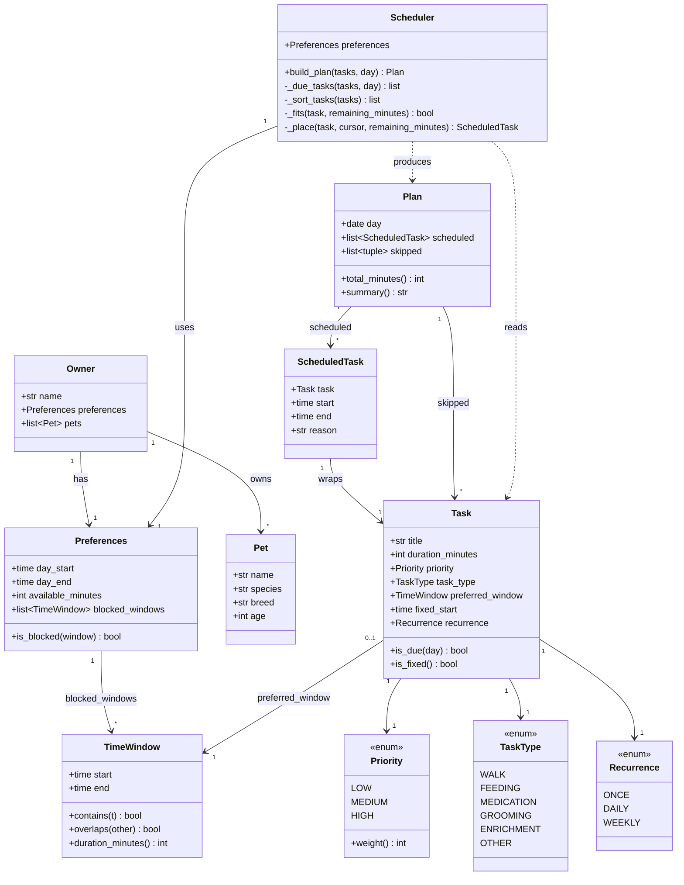

# PawPal+ — UML Class Diagram

Class diagram reflecting the models in `pawpal/models.py` and the scheduler in
`pawpal/scheduler.py`.

```mermaid
classDiagram
    class Priority {
        <<enum>>
        LOW
        MEDIUM
        HIGH
        +weight() int
    }

    class TaskType {
        <<enum>>
        WALK
        FEEDING
        MEDICATION
        GROOMING
        ENRICHMENT
        OTHER
    }

    class Recurrence {
        <<enum>>
        ONCE
        DAILY
        WEEKLY
    }

    class TimeWindow {
        +time start
        +time end
        +contains(t) bool
        +overlaps(other) bool
        +duration_minutes() int
    }

    class Preferences {
        +time day_start
        +time day_end
        +int available_minutes
        +list~TimeWindow~ blocked_windows
        +is_blocked(window) bool
    }

    class Pet {
        +str name
        +str species
        +str breed
        +int age
    }

    class Owner {
        +str name
        +Preferences preferences
        +list~Pet~ pets
    }

    class Task {
        +str title
        +int duration_minutes
        +Priority priority
        +TaskType task_type
        +TimeWindow preferred_window
        +time fixed_start
        +Recurrence recurrence
        +is_due(day) bool
        +is_fixed() bool
    }

    class ScheduledTask {
        +Task task
        +time start
        +time end
        +str reason
    }

    class Plan {
        +date day
        +list~ScheduledTask~ scheduled
        +list~tuple~ skipped
        +total_minutes() int
        +summary() str
    }

    class Scheduler {
        +Preferences preferences
        +build_plan(tasks, day) Plan
        -_due_tasks(tasks, day) list
        -_sort_tasks(tasks) list
        -_fits(task, remaining_minutes) bool
        -_place(task, cursor, remaining_minutes) ScheduledTask
    }

    Owner "1" --> "1" Preferences : has
    Owner "1" --> "*" Pet : owns
    Preferences "1" --> "*" TimeWindow : blocked_windows
    Task "1" --> "1" Priority
    Task "1" --> "1" TaskType
    Task "1" --> "1" Recurrence
    Task "0..1" --> "1" TimeWindow : preferred_window
    ScheduledTask "1" --> "1" Task : wraps
    Plan "1" --> "*" ScheduledTask : scheduled
    Plan "1" --> "*" Task : skipped
    Scheduler "1" --> "1" Preferences : uses
    Scheduler ..> Plan : produces
    Scheduler ..> Task : reads
```
